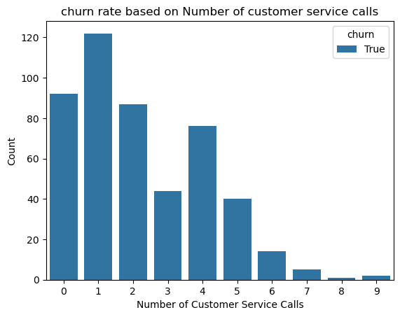
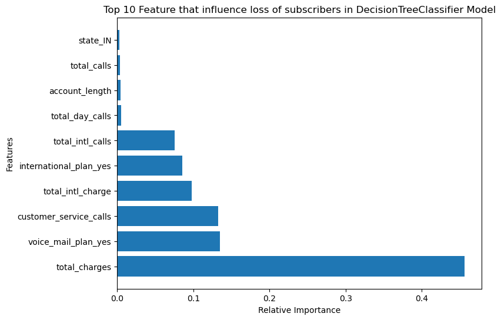

# TITLE:MACHINE LEARNING CLASSIFICATION MODEL FOR PREDICTING CUSTOMER CHURN AT SYRIA TEL.

# 1.0 Project Overview/Business understanding.
## 1.1 Introduction

Client churn, also known as customer churn or subscriber churn, refers to the loss of customers or subscribers over a specific period of time.

Fighting client churn has become a crucial concern in the dynamic telecommunications sector, as customers have many options for service providers and frequently switch carriers.Currently,the industry's typical yearly churn rate in the US ranges from 11% to 25% according to latest report (year 2020) by statista https://www.statista.com/statistics/816735/customer-churn-rate-by-industry-us/, and keeping current clients has become crucial. Acknowledging the significant financial difference between bringing in new clients and keeping existing clients, seasoned operators make keeping existing clients their top priority.

Understanding and reducing client churn is essential for businesses because:

Churn directly translates to lost recurring revenue. Retaining existing clients is generally cheaper than acquiring new ones.

Combating Client Churn: Companies can implement various strategies to reduce churn:
For example
Customer Satisfaction Surveys: Understanding customer pain points and satisfaction levels helps to identify areas for improvement.
Loyalty Programs: Reward programs and incentives can encourage customers to stay.
Improved Customer Service: Providing excellent customer support builds trust and loyalty.

## 1.2 Problem statement

SyriaTel, a telecommunications company, has experienced a significant rise in customer churn rates within the US market during the past financial period. This churn is leading to customer loss and negatively impacting SyriaTel's revenue. To address this challenge,I aim to develop a machine learning model that will help SyriaTel company's stakeholders to identify customers at risk of churn in the US.Additionally,this model will be used to develop targeted customer retention strategies and mitigate churn.

# 1.3 Objectives
# 1.3.1 Main objective

 To develop a machine learning classification model that accurately predicts customer churn in the US market for SyriaTel, enabling them to identify customers at high risk of churning and implement targeted customer retention strategies.
 
 
# 1.3.2 Specific objectives

1. To identify the key factors that contribute to customer churn in Syria Tel.
2. To develop a model that will accurately predict the probability of churn for individual customers in the US market.
3. To determine the likely solution to lower churn.
 

# 2.0 Data Understanding.
The data is obtained from kaggle website.

Data Source : https://www.kaggle.com/datasets/becksddf/churn-in-telecoms-dataset 

The data set is made up of 21 columns made up of different features as shown below:

Summary of Features in the Dataset
* state: the state the customer lives in - different states in America
* account length: the number of days since the customer possessed an account
* area code: the area code of the customer
* phone number: the phone number of the customer
* international plan: true if the customer has the international plan, otherwise false
* voice mail plan: true if the customer has the voice mail plan, otherwise false
* number vmail messages: the number of voicemails the customer has sent
* total day minutes: total number of minutes the customer has been on calls during the day
* total day calls: total number of calls the user has made during the day
* total day charge: total amount of money the customer was charged by the Telecom company for calls made during the day
* total eve minutes: total number of minutes the customer has been on calls in the evening
* total eve calls: total number of calls the customer has made in the evening
* total eve charge: total amount of money the customer was charged by the Telecom company for calls made in the evening
* total night minutes: total number of minutes the customer has been on calls during the night
* total night calls: total number of calls the customer has done during the night
* total night charge: total amount of money the customer was charged by the Telecom company for calls made during the night
* total intl minutes: total number of minutes the user has been on international calls
* total intl calls: total number of international calls the customer has made
* total intl charge: total amount of money the customer was charged by the Telecom company for international calls
* customer service calls: number of calls the customer has made to customer service
* churn: target variable which is true if the customer terminated their contract, otherwise false
  
# 2.1 Data Preparation
* Data was clean and had no missing values 
* Removed hyphen from phone numbers and converted them to integers
* Droped the area code since it had no much influence on our data set since we had the state column which equally showed geaographical area

# 3.0 Data Analysis
Did Univariate ,Bivariate and multivariate analysis.

I noticed that rate of loss of customers /subscribers in syriatel was higher for the people who only made one customer service call followed by the customers who did not even bother making even a single call.Customers who had be used to making upto 9 customer calls had a lower rate of churn
Also the highest loss of customers is witnessed as the total_number of minutes increase 
# 4.0 Modelling
I started with the preprocessing process 
First made a copy of data and then checked for multicollineality
defined my target variable y = churn
The remaining variables represented independent variables  X_variables

# 4.1 Classification and Evaluation
1. Baseline model:"vanilla" model(DecisionTreeClassifier)
    had an accuracy of 0.98 and a recall score of 0.872
2. Logistic Regression model
    Had an accuracy of 0.86 and a recall score of 0.224.
    Overall this is the model that performed poorly
3. XGBoost classifier
   Had an accuracy of 0.98 and a recall score of 0.864
   second best perfoorming model after our baseline model
Went Ahead and fitted a pipeline and Grid Search to see if there would be an improvement on the models.
4. Randomforest with pipeline and GridSearch
   Had an accuracy of 0.96 and a recall score of 0.832 an improvement from the previous random forest classifier
   which had an accuracy of 0.96 and a recall score of 0.736
   

Important features that were influencing the performance of our Baseline model were:
Total charges,international plan yes(that is a customer having an international plan) and customer service calls are features contributing to customer churn.While account_length and totalnight minutes had a less or minimal effect on customer churn.

# 5.0 Conclusions
The project yielded the desired results. The main objective and specific objectives were all satisfied.
The best model that modeled our data and gave us the desired results was DecisionTreeClassifier.
Total charges,a customer having an international plan and customer service calls are the features that highly contributed to loss of subscribers fromSyriatel company.While account_length and totalnight minutes had a less or minimal effect on customer churn.
Noted a higher customer rate churn in NewJersey and California state.
Additionally, voice mail plan is not highly desired by customers.

# 6.0 Recommendations
I would recommend Syriatel Company stakeholders to:

1. Check on how they charge their customers and reduce the total charges.This will enable to retain the subscribers and reduce the rate churn.
2. Look into their international plan,get to know what they are doing wrong,may be they are overcharging the service as compared to their              competitors in the job market,making customers to leave and look for cheaper international plans.
3. Retrain the personnel that handles the customer service desks on how to handle and address customer's complaints and how to effectively listen      and be good to the customers.This will make a customer feel appreciated and as a company we will be able to even retain this customer as our        subscriber.Also as the stakehoders emphasis on first impression, it really matters,since most subscribers who left had only made 1 customer          service call.
4. Redefine how the company does its operations in Newjersey and California,since they were the state that had the highest customer churn rate         Maybe also do research and realize what the other competitive service providers are doing to retain their subscribers.
